# Open-source Leader Arm

Open-source, low-cost, 3D-printed leader arm for teleoperating an SO-ARM 

https://github.com/user-attachments/assets/977a0b56-c7d2-4a90-b86a-445dd3963871

A leader arm is moved by an operator to teleoperate a follower robot arm. A leader arm's joints are never driven, they simply report their joint angles, which the follower mirrors. So instead of using expensive servos, a cheap magnetic encoder like the AS5600 can be used. It results in an arm which is lighter to move by hand and is much cheaper than the one built with servos. 

Currently, the leader arm is tested against a simulated SO-ARM in MuJoCo with live physics, so you can pick up and move objects in the scene without a physical follower arm.


## Bill of materials

|Component| Quantity | Price|
|-|-|-|
|AS5600 encoder + Diametric magnet (5mm dia,2mm thick) | 6 | 6 x 186 INR = 1,116 INR (~11.7 USD)|
|608 Bearing (8x22x7mm) | 6 | 6 x 30 INR = 180 INR (~1.9 USD)|
| CJMCU TCA9548A I2C 8 Channel Multiplexer| 1 | 59 INR (~0.6 USD)|
|ESP32 | 1 | 550 INR (~5.8 USD)|
|28 AWG Silicon Wires | ~5m per color (4 colors) | 477 INR (~ 5 USD)|
|M3x10mm screws | 60 | 195 INR (~2 USD)|
|7x9cm Perfboard | 1 | 42 INR (~0.45 USD)|
| Rubber band | 1 | Negligible|
| |Total | 2,619 INR (~27.45 USD)|

Excluding the price of the 3D printed parts.

For context: the STS3215 servo used in the standard LeRobot leader arm costs around 24 USD each, and the leader arm needs six, roughly 144 USD in servos alone. Our entire component list comes in under 28 USD.

Note: The encoder and diametric magnet almost always come as a combo. Try to buy them together, the diametric magnet on its own can be difficult to source. 

## How it works?
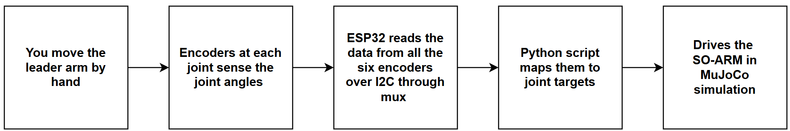

**Why a mux?** - The AS5600 encoder has a fixed I2C address (0x36) and can't be changed. So we can't put more than one on a bus as they will all share the same address. The TCA9548A mux gives each encoder its own separate channel and connects one channel to the ESP32 at a time, so all six encoders can be read without any collision. 


## Wiring
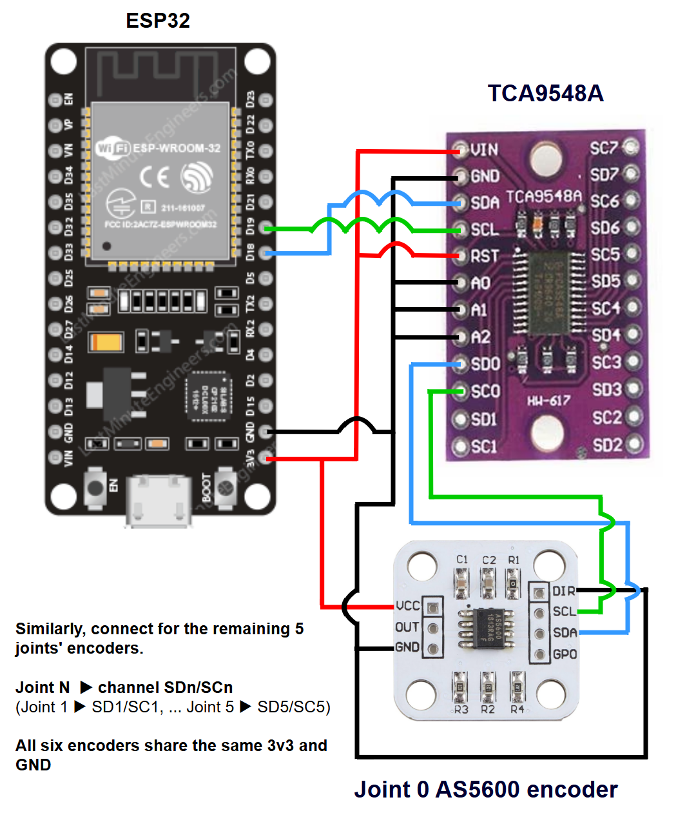

| TCA9548A | ESP32 | 
| ------ | ------ |
| VIN | 3V3 |
| GND | GND |
| SDA | D18 |
| SCL | D19 |
| RST | 3V3 |
| A0, A1, A2 | GND |

| AS5600 | ESP32 |
| ------ | ------ |
| VCC | 3V3 |
| GND, DIR | GND |

| AS5600 | TCA9548A |
|--------|----------|
| SDA | SDn |
| SCL | SCn |

n = the channel for that joint \
joint 0 → SD0/SC0, ... joint 5 → SD5/SC5


## Print Settings

Printed in PLA, 0.2mm layer height and 15% infill.

There are 19 unique parts and a total of 49 parts. All the parts are designed to not need support while printing. All the parts are already oriented for printing; if any part loads at an odd angle, lay its flat face on the bed. 

The part 'bearing_housing' needs a bearing inserted mid-print. Add a pause at 10mm height (layer 50 at 0.2mm layer height setting). In Bambu studio, right-click the corresponding layer on the vertical slider and choose "Add Pause". When the printer pauses, insert the 608 bearing into the pocket, make sure it is seated flat, and then resume.

### Parts list and count

```
1 x base
1 x base_connector
6 x bearing_housing
6 x encoder_housing
5 x encoder_housing_cap
6 x rotor 
3 x link_perpendicular_base
3 x link_perpendicular_body
1 x link_shoulder_to_elbow
1 x link_elbow_to_wrist
1 x link_tooltip 
3 x washer_perpendicular_link 
3 x washer_round
1 x handle_base
1 x handle_body
1 x rest_pose_holder_base
1 x rest_pose_holder_body
3 x wire_holder
2 x rubberband_housing
```

## Firmware

Flash firmware.ino to the ESP32 using the Arduino IDE: 

1. Install the ESP32 board support (Tools → Board → Boards Manager → search "esp32")
2. Open 'firmware/firmware.ino' and select your ESP32 board and port, and upload.
3. After uploading, open the serial monitor at **115200 baud rate** to check the output.

The firmware uses only the built-in 'Wire' library, so there's nothing else to install.

On boot it prints a channel scan. It prints "-1" if there is an issue with the connection, missing magnet or miswired encoder etc.,

If everything works then it prints "magnet ok"

Example : # ch0: AS5600 found, magnet ok, raw 1234

After the scan, it streams the six encoder readings as a comma-separated line, at 100 Hz.


## Running the software

The python side reads the encoder stream and drives a simulated SO-ARM in MuJoCo.

Install the dependencies and clone the robot model (the scripts expect it in the working directory)

```bash
pip install "mujoco>=3.2" pyserial
git clone https://github.com/google-deepmind/mujoco_menagerie.git
```

Then run one of the two scripts, passing your ESP32's port:

```bash
python teleop.py --port COM3              # plain teleop, empty scene
python teleop_sort_task.py --port COM3    # teleop + block sorting
```

On Linux, the port looks like '/dev/ttyUSB0'.

The script opens the simulated follower arm in its natural rest pose (hardcoded as the reference pose), so when the script starts, hold the leader arm in its reference pose and press ENTER. This makes sure that both the leader and the follower arm start with the same pose.

## Assembly guide

This leader arm has six joints, `joint_0` to `joint_5`.
### Before you start : 
- See the print settings section for the full parts list and count
- Use the images in the guide for parts orientation and alignment. The assembly files under cad_files are also helpful for this.
- Notation : A + B means "attach part B to part A or assembly A". assembly_step_N refers to the result of step N. 
- Only joint_0 and joint_5 get their encoder attached immediately. The remaining four joints get their encoders at the very end, so that there is less wire clutter during the assembly.
 
### Steps : 
1. Start by wiring all the six encoders as shown in `wiring.png`.
2. insert the diametric magnet into the circular pocket provided in the `rotor` (for all 6 rotors)
3. `rotor + bearing_housing + link_perpendicular_base + link_perpendicular_body + washer_perpendicular_link` (`joint_0`)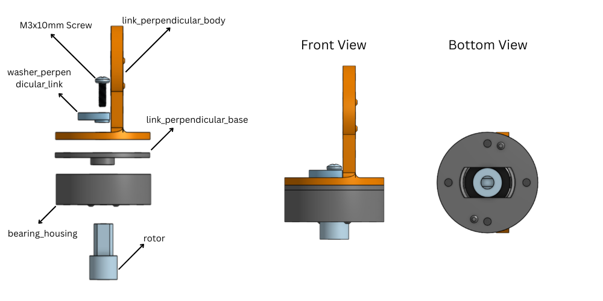
4. `assembly_step_3 + base_connector` 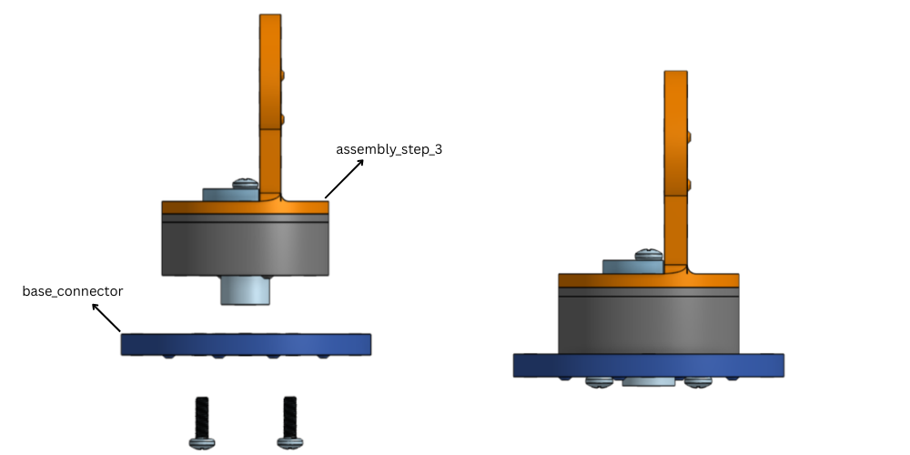
5. `assembly_step_4 + encoder_housing + AS5600_encoder` 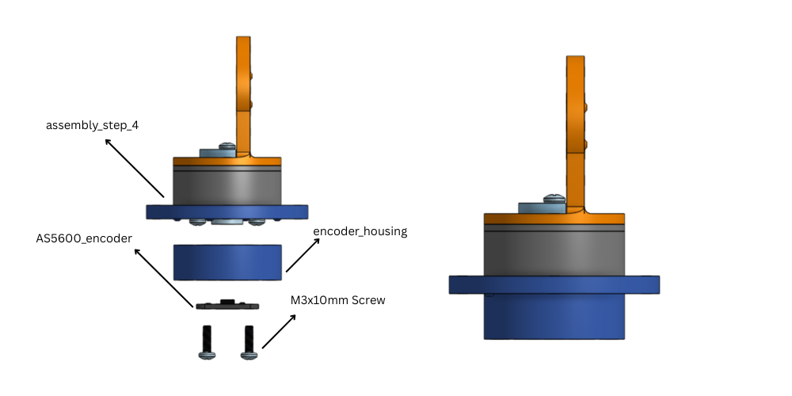
6. Tie a knot in the wire, then attach the `encoder_housing_cap`, so that a wire pull doesn't act on the encoder. 
7. `assembly_step_6 + base` 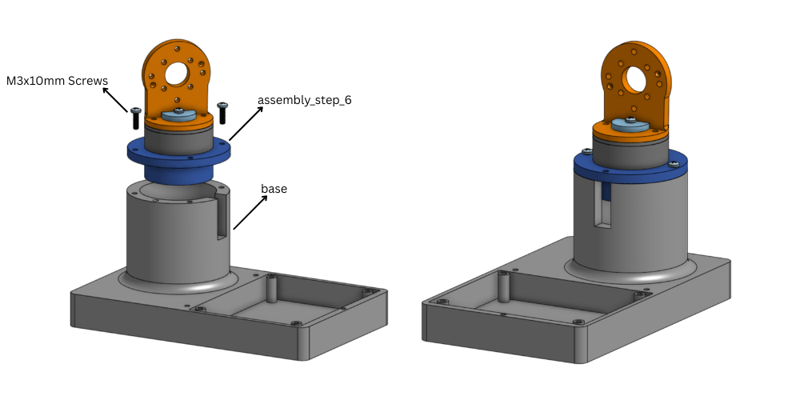
8. `assembly_step_7 + rest_pose_holder_base + rest_pose_holder_body` 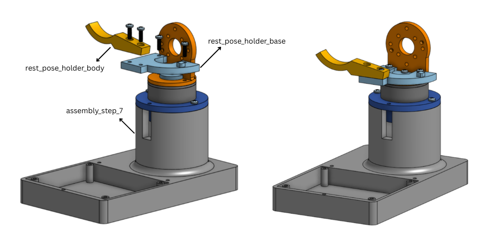
9. `assembly_step_8 + bearing_housing` 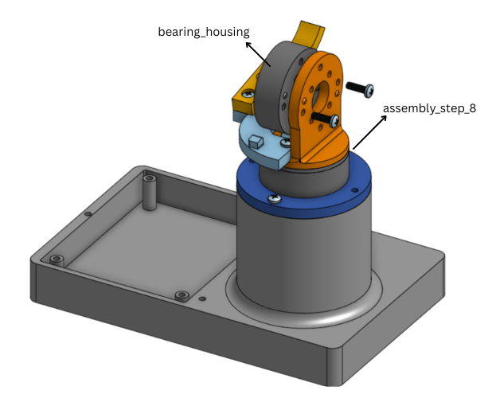
10. `assembly_step_9 + rotor + link_shoulder_to_elbow + washer_round` (`joint_1`)
11. `link_shoulder_to_elbow + bearing_housing` (similar to step 9)
12. `assembly_step_11 + rotor + link_elbow_to_wrist + washer_round` (similar to step 10) (`joint_2`)
13. `link_elbow_to_wrist + bearing_housing` (similar to step 11)
14. `assembly_step_13 + rotor + link_perpendicular_base + link_perpendicular_body + washer_perpendicular_link` (similar to step 3) (`joint_3`)
15. `assembly_step_14 + bearing_housing` (similar to step 9)
16. `assembly_step_15 + rotor + link_perpendicular_base + link_perpendicular_body + washer_perpendicular_link` (similar to step 14) (`joint_4`)
17. `assembly_step_16 + bearing_housing` (similar to steps 9 and 15)
18. `assembly_step_17 + rotor + link_tooltip + washer_round` (`joint_5`)
19. `assembly_step_18 + encoder_housing + AS5600_encoder`
20. Tie a knot in the wire as in step 6
21. `assembly_step_20 + handle_base` (the `handle_base` also acts here as the `encoder_housing_cap`) 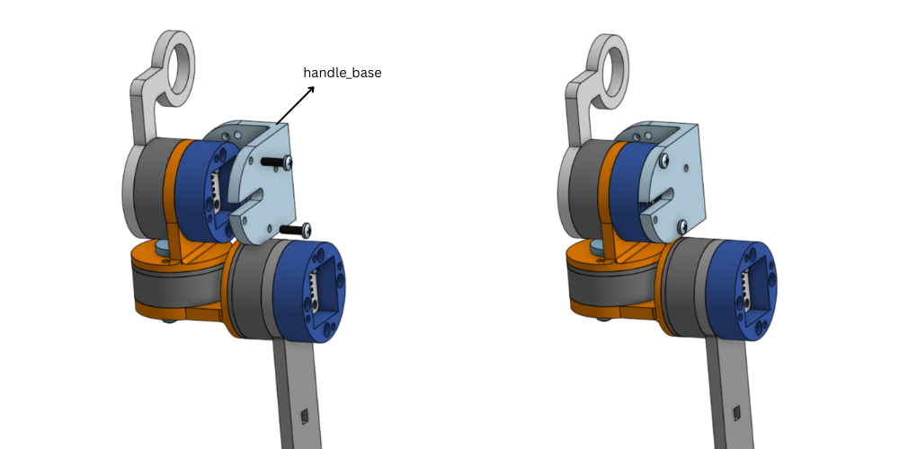
22. `assembly_step_21 + handle_body` 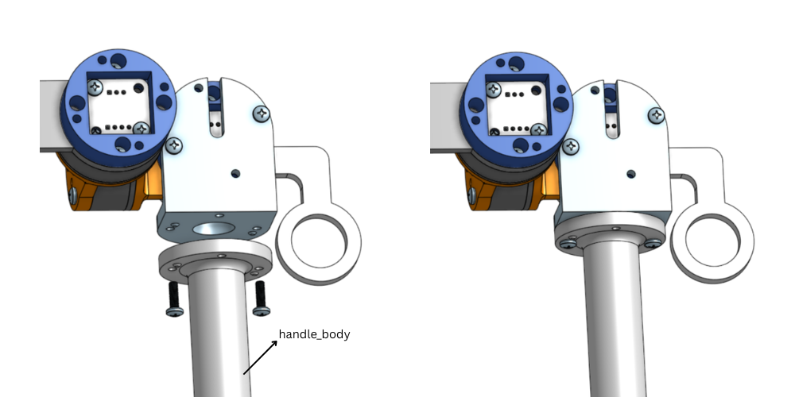
23. attach the three `wire_holder`s on `link_shoulder_to_elbow` and `link_elbow_to_wrist`. 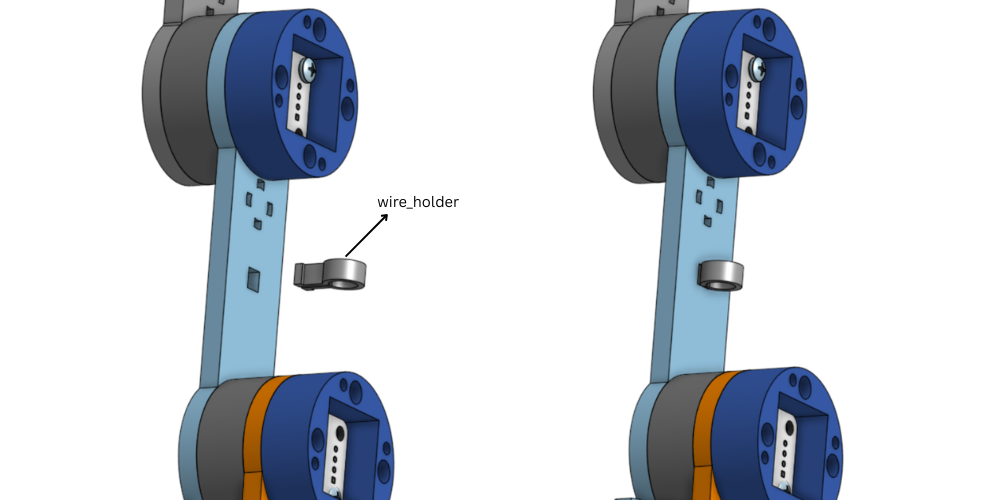
24. Route a single rubberband through both `rubberband_housings`, then fix one housing to `link_shoulder_to_elbow` and one to `link_elbow_to_wrist`. 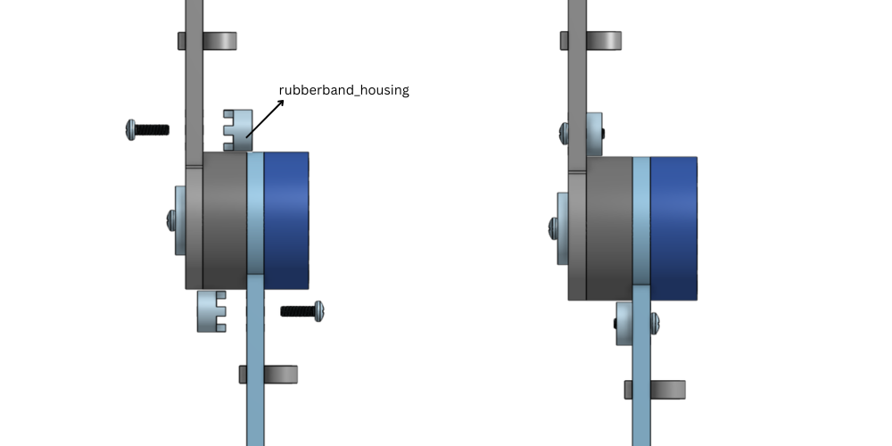
25. attach the `encoder_housing + AS5600_encoder`, tie a knot, and attach the `encoder_housing_cap` for the four remaining joints, in the same way as step 5 or step 19. 

## Acknowledgements

This project builds on the work of several open-source projects:

- [SO-ARM100](https://github.com/TheRobotStudio/SO-ARM100) - the follower arm design this leader is built to teleoperate.
- [LeRobot](https://github.com/huggingface/lerobot) - the leader/follower teleoperation approach this project is based on.
- [MuJoCo Menagerie](https://github.com/google-deepmind/mujoco_menagerie) - the SO-ARM simulation model used by the teleop scripts.
